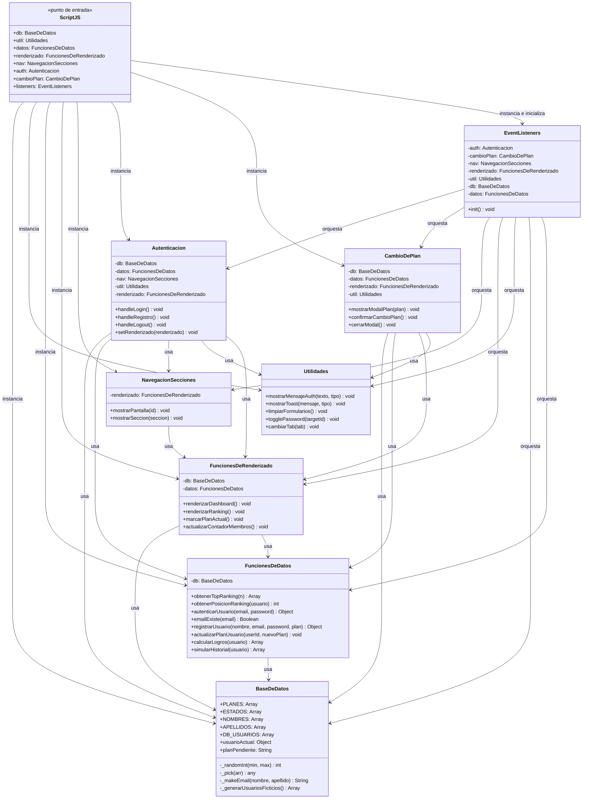

# 🏋️ IRONFORGE GYM — Sistema de Gestión

## 👥 Integrantes

| Nombre |
|---|
| Gaston Magariños |
| Giovanni Bisignani |
| Agustin Ferrer Quaglia |
| Ignacio Robaina |
| Tiago Delfini |

---

Aplicación web de gestión de gimnasio desarrollada con HTML, CSS y JavaScript vanilla. Permite a los miembros iniciar sesión, visualizar su dashboard personalizado, consultar el ranking de asistencias y gestionar su plan de membresía.

---

## 🚀 Funcionalidades

- **Autenticación** — Login y registro de usuarios con validaciones de cliente
- **Dashboard personalizado** — Asistencias, logros desbloqueados e historial semanal
- **Ranking** — Podio y tabla Top 10 de miembros más constantes
- **Gestión de planes** — Cambio de plan con modal de confirmación
- **Base de datos simulada** — 100 usuarios ficticios generados automáticamente

---

## 🗂️ Estructura del proyecto

```
files/
├── index.html                   # Estructura principal de la app
├── style.css                    # Estilos globales
├── script.js                    # Punto de entrada — instancia todas las clases
├── basededatos.js               # Clase BaseDeDatos
├── funcionesdedatos.js          # Clase FuncionesDeDatos
├── funcionesderenderizado.JS    # Clase FuncionesDeRenderizado
├── navegacionsecciones.js       # Clase NavegacionSecciones
├── autenticacion.js             # Clase Autenticacion
├── cambiodeplan.js              # Clase CambioDePlan
├── utilidades.js                # Clase Utilidades
└── eventlistener.js             # Clase EventListeners
```

---

## ⚙️ Arquitectura

Cada módulo está encapsulado en una **clase JavaScript**. `script.js` actúa como punto de entrada, instancia todas las clases respetando el orden de dependencias e inyecta las referencias necesarias entre módulos.

---

## 📐 Diagrama de Clases UML



---

## ▶️ Cómo ejecutar

1. Clonar o descargar el repositorio
2. Abrir `index.html` en cualquier navegador moderno
3. Usar las credenciales demo para probar la app:

| Usuario | Email | Contraseña |
|---|---|---|
| Carlos García | carlos.garcia@gym.com | Pass1234 |
| Lucía Martínez | lucia.martinez@gym.com | Pass1234 |
| Pedro López | pedro.lopez@gym.com | Pass1234 |

> No requiere servidor ni dependencias externas.
