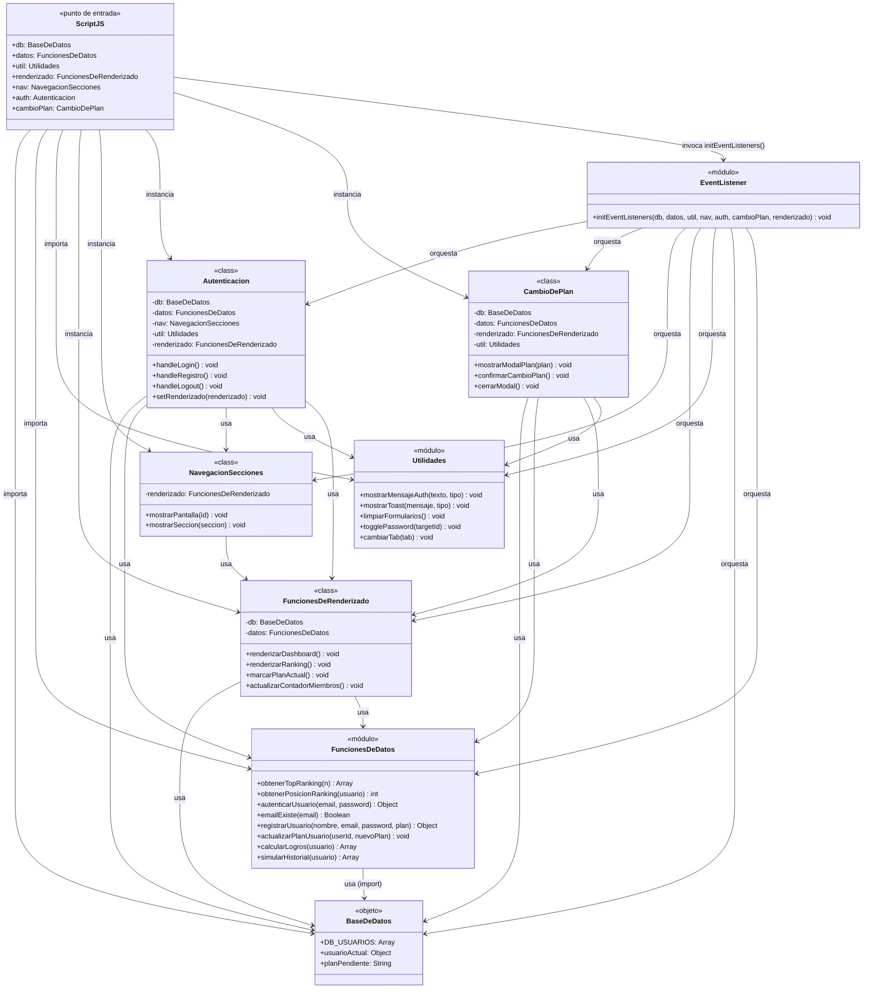

# 🏋️ IRONFORGE GYM — Sistema de Gestión

## 👥 Integrantes

| Nombre |
|---|
| Gaston Magariños |
| Giovanni Bisignani |
| Agustin Ferrer Quaglia |
| Ignacio Robaina |
| Tiago Delfini |

---

Aplicación web de gestión de gimnasio desarrollada con HTML, CSS y JavaScript vanilla. Permite a los miembros iniciar sesión, visualizar su dashboard personalizado, consultar el ranking de asistencias y gestionar su plan de membresía.

---

## 🚀 Funcionalidades

- **Autenticación** — Login y registro de usuarios con validaciones de cliente
- **Dashboard personalizado** — Asistencias, logros desbloqueados e historial semanal
- **Ranking** — Podio y tabla Top 10 de miembros más constantes
- **Gestión de planes** — Cambio de plan con modal de confirmación
- **Base de datos simulada** — 100 usuarios ficticios generados automáticamente

---

## 🗂️ Estructura del proyecto

```
files/
├── index.html                   # Estructura principal de la app
├── style.css                    # Estilos globales
├── script.js                    # Punto de entrada — importa todos los módulos,
│                                 #   instancia las clases e inicializa los listeners
├── basededatos.js               # Objeto db (estado global: usuarios, sesión, plan pendiente)
├── funcionesdedatos.js          # Módulo de funciones de datos (se agrupan como "datos")
├── funcionesderenderizado.js    # Clase FuncionesDeRenderizado
├── navegacionsecciones.js       # Clase NavegacionSecciones
├── autenticacion.js             # Clase Autenticacion
├── cambiodeplan.js              # Clase CambioDePlan
├── utilidades.js                # Módulo de funciones de UI (se agrupan como "util")
└── eventlistener.js             # Módulo con initEventListeners(), conecta el DOM
```

---

## ⚙️ Arquitectura

El proyecto combina dos enfoques: los módulos con estado o lógica de UI compleja (`FuncionesDeRenderizado`, `NavegacionSecciones`, `Autenticacion`, `CambioDePlan`) están encapsulados en **clases JavaScript** con inyección de dependencias por constructor. Los módulos más simples (`basededatos.js`, `funcionesdedatos.js`, `utilidades.js`, `eventlistener.js`) exportan un objeto de estado o funciones sueltas con ES Modules (`export` / `import`), sin necesidad de instanciarse con `new`.

`script.js` actúa como punto de entrada: importa todos los módulos, agrupa las funciones exportadas en los objetos `datos` y `util`, instancia las clases respetando el orden de dependencias, inyecta las referencias necesarias entre ellas y finalmente llama a `initEventListeners()` para conectar los listeners del DOM.

---

## 📐 Diagrama de Clases UML


```mermaid
classDiagram
    class BaseDeDatos {
        <<objeto>>
        +DB_USUARIOS: Array
        +usuarioActual: Object
        +planPendiente: String
    }

    class FuncionesDeDatos {
        <<módulo>>
        +obtenerTopRanking(n) Array
        +obtenerPosicionRanking(usuario) int
        +autenticarUsuario(email, password) Object
        +emailExiste(email) Boolean
        +registrarUsuario(nombre, email, password, plan) Object
        +actualizarPlanUsuario(userId, nuevoPlan) void
        +calcularLogros(usuario) Array
        +simularHistorial(usuario) Array
    }

    class FuncionesDeRenderizado {
        <<class>>
        -db: BaseDeDatos
        -datos: FuncionesDeDatos
        +renderizarDashboard() void
        +renderizarRanking() void
        +marcarPlanActual() void
        +actualizarContadorMiembros() void
    }

    class NavegacionSecciones {
        <<class>>
        -renderizado: FuncionesDeRenderizado
        +mostrarPantalla(id) void
        +mostrarSeccion(seccion) void
    }

    class Autenticacion {
        <<class>>
        -db: BaseDeDatos
        -datos: FuncionesDeDatos
        -nav: NavegacionSecciones
        -util: Utilidades
        -renderizado: FuncionesDeRenderizado
        +handleLogin() void
        +handleRegistro() void
        +handleLogout() void
        +setRenderizado(renderizado) void
    }

    class CambioDePlan {
        <<class>>
        -db: BaseDeDatos
        -datos: FuncionesDeDatos
        -renderizado: FuncionesDeRenderizado
        -util: Utilidades
        +mostrarModalPlan(plan) void
        +confirmarCambioPlan() void
        +cerrarModal() void
    }

    class Utilidades {
        <<módulo>>
        +mostrarMensajeAuth(texto, tipo) void
        +mostrarToast(mensaje, tipo) void
        +limpiarFormularios() void
        +togglePassword(targetId) void
        +cambiarTab(tab) void
    }

    class EventListener {
        <<módulo>>
        +initEventListeners(db, datos, util, nav, auth, cambioPlan, renderizado) void
    }

    FuncionesDeDatos --> BaseDeDatos : usa (import)
    FuncionesDeRenderizado --> BaseDeDatos : usa
    FuncionesDeRenderizado --> FuncionesDeDatos : usa
    NavegacionSecciones --> FuncionesDeRenderizado : usa
    Autenticacion --> BaseDeDatos : usa
    Autenticacion --> FuncionesDeDatos : usa
    Autenticacion --> NavegacionSecciones : usa
    Autenticacion --> Utilidades : usa
    Autenticacion --> FuncionesDeRenderizado : usa
    CambioDePlan --> BaseDeDatos : usa
    CambioDePlan --> FuncionesDeDatos : usa
    CambioDePlan --> FuncionesDeRenderizado : usa
    CambioDePlan --> Utilidades : usa
    EventListener --> Autenticacion : orquesta
    EventListener --> CambioDePlan : orquesta
    EventListener --> NavegacionSecciones : orquesta
    EventListener --> FuncionesDeRenderizado : orquesta
    EventListener --> Utilidades : orquesta
    EventListener --> BaseDeDatos : orquesta
    EventListener --> FuncionesDeDatos : orquesta

    class ScriptJS {
        <<punto de entrada>>
        +db: BaseDeDatos
        +datos: FuncionesDeDatos
        +util: Utilidades
        +renderizado: FuncionesDeRenderizado
        +nav: NavegacionSecciones
        +auth: Autenticacion
        +cambioPlan: CambioDePlan
    }

    ScriptJS --> BaseDeDatos : importa
    ScriptJS --> FuncionesDeDatos : importa
    ScriptJS --> Utilidades : importa
    ScriptJS --> FuncionesDeRenderizado : instancia
    ScriptJS --> NavegacionSecciones : instancia
    ScriptJS --> Autenticacion : instancia
    ScriptJS --> CambioDePlan : instancia
    ScriptJS --> EventListener : invoca initEventListeners()
```

---

## ▶️ Cómo ejecutar

1. Clonar o descargar el repositorio
2. Abrir `index.html` en cualquier navegador moderno
3. Usar las credenciales demo para probar la app:

| Usuario | Email | Contraseña |
|---|---|---|
| Carlos García | carlos.garcia@gym.com | Pass1234 |
| Lucía Martínez | lucia.martinez@gym.com | Pass1234 |
| Pedro López | pedro.lopez@gym.com | Pass1234 |

> No requiere servidor ni dependencias externas.